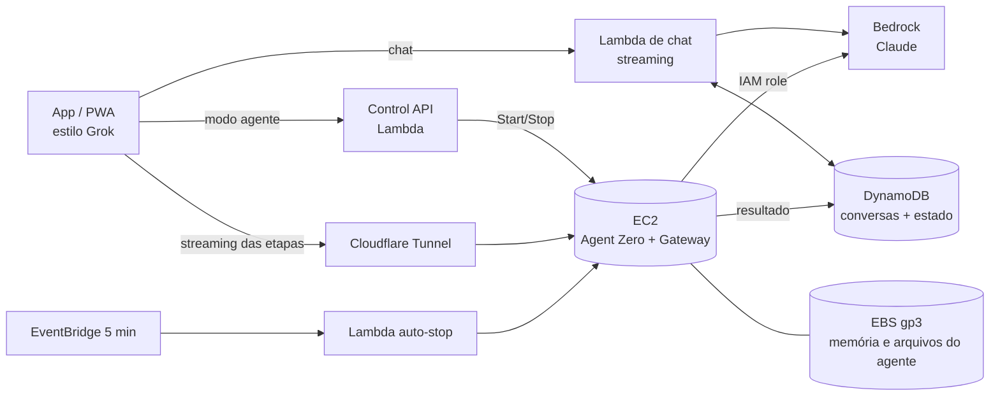

# Arquitetura — App pessoal com Agent Zero na AWS

Status: **proposta** (nada disso foi provisionado ainda).

## Objetivo

- App com experiência parecida com o Grok: resposta **instantânea** em streaming, tela limpa, campo de mensagem central, histórico na lateral, etapas de "pensando" que dá para expandir, voz e anexos.
- Pagar computação **só quando usar**.
- Usar VM só onde ela é realmente necessária.

## A VM é necessária?

Só para o **modo agente**, quando o Agent Zero executa código, navega na web, mexe em arquivos ou roda tarefas longas. Isso precisa de um ambiente Linux com estado.

Para **conversar**, que é a maior parte do uso de um app estilo Grok, não precisa de VM. Uma Lambda chama o Claude no Bedrock e devolve a resposta em streaming na hora. Se toda mensagem dependesse de acordar uma VM, cada conversa nova começaria com ~60–90s de espera, o que mata a sensação de Grok.

### Opções avaliadas

| Opção | Partida a frio | Custo ocioso | Esforço | Veredito |
|---|---|---|---|---|
| **A. Tudo no EC2 liga/desliga** | 60–90s em toda conversa nova | só disco (~$3) | baixo | simples, mas UX lenta |
| **B. Tudo no Fargate (escala a zero)** | 1–3 min (imagem grande) | disco EFS | médio | sem ganho real sobre A |
| **C. 100% serverless (Bedrock AgentCore / agente próprio)** | ~0 | ~0 | **alto**: abandona o Agent Zero | caminho futuro se virar produto multiusuário |
| **D. Híbrido: chat serverless + agente no EC2 sob demanda** | **chat 0s**, agente 60–90s | só disco (~$3) | médio | ✅ **recomendado** |

## Arquitetura recomendada (D, híbrida)

### Como o uso flui
1. Você abre o app e manda uma mensagem. A **Lambda de chat** responde em streaming na hora, usando Haiku, Sonnet ou Opus conforme o modo.
2. Quando a tarefa pede execução (rodar código, pesquisar a fundo, mexer em arquivos), você liga o **modo agente**, ou o próprio Claude sugere ligar.
   - O app liga a VM e mostra "Acordando o agente… ~60s".
   - A tarefa entra na fila e é enviada ao Agent Zero quando ele estiver pronto.
3. As etapas do agente aparecem num bloco "Pensando…" recolhível, como no Grok. O resultado final volta para a mesma conversa.
4. Sem uso, a VM desliga sozinha.

### Componentes

**1. Frontend (sempre ligado, ~grátis)**
- **Next.js como PWA**, hospedado em S3 + CloudFront (ou Vercel). Instala no celular e no desktop como app.
- Se depois quiser app nas lojas: **Expo / React Native**, reaproveitando a mesma API.
- UX estilo Grok:
  - tema escuro, saudação e campo de entrada centralizados;
  - chips **Rápido / Padrão / Power** e o botão **Agente**;
  - **"ver tela"**: acompanhar ao vivo o navegador e o desktop do agente (ver seção 5);
  - histórico com busca;
  - anexos e modo voz.

**2. Lambda de chat (sempre disponível, paga por uso)**
- Lambda **Function URL com response streaming**, que chama a Bedrock `ConverseStream`.
- Conversas no **DynamoDB**. Assim o histórico abre na hora, mesmo com a VM desligada.
- Login: **Cognito**, ou um provedor como Clerk/Auth0.

**3. Control API + auto-stop**

| Rota | Função |
|---|---|
| `GET /agent/status` | estado da VM: `stopped / starting / ready / busy / stopping` |
| `POST /agent/start` | `ec2:StartInstances` e espera o health check passar |
| `POST /agent/stop` | desliga manualmente |
| `POST /agent/task` | põe a tarefa na fila (SQS) e liga a VM se precisar |

- **EventBridge** a cada 5 min desliga a VM se:
  - está ociosa há **20 min** (configurável), **e**
  - **nenhuma tarefa está rodando**. Nunca mata uma tarefa no meio.
- Redes de segurança: **tempo máximo ligado** (ex.: 6h) e **AWS Budgets** com alerta por e-mail.

**4. VM do agente (só liga sob demanda)**
- **EC2 `t3.large`** (2 vCPU, 8 GB), `us-east-1`.
- **AMI própria** já com Docker, Agent Zero, dependências e `cloudflared`. Serviço `systemd` sobe tudo no boot.
- **Gateway fino (FastAPI)** ao lado do Agent Zero:
  - consome a fila SQS;
  - traduz a API do Agent Zero (`/api_message`, `/api_log_get`, websocket) para SSE;
  - grava o resultado no DynamoDB;
  - informa "ocupado / ocioso" ao auto-stop.
- **IAM Instance Role** com `bedrock:InvokeModel*`. Nenhuma chave guardada na VM.
- Memória do agente e arquivos ficam no **EBS**, que persiste desligado. Snapshot diário.
- Acesso por **Cloudflare Tunnel**: domínio fixo, HTTPS, nenhuma porta aberta.

### 5. Tela ao vivo: ver o que o agente está fazendo

Como no Grok, dá para clicar e ver a tela do computador do agente em tempo real. O Agent Zero já traz as duas peças. Elas só existem no **modo agente**, porque rodam na VM:

| Superfície | O que mostra | Tecnologia (já no Agent Zero) |
|---|---|---|
| **Navegador ao vivo** | o Chromium que o agente usa para pesquisar e preencher formulários | screencast via websocket, com histórico de screenshots |
| **Desktop** | área de trabalho Linux (XFCE): terminal, arquivos, LibreOffice | Xvfb + **Xpra** (cliente HTML5 no navegador) |

UX no app:
- Enquanto o agente trabalha, aparece na conversa um card **"Agente trabalhando · ver tela"** com uma miniatura ao vivo.
- Ao clicar, abre um painel lateral no desktop ou tela cheia no celular, com abas **Navegador / Desktop**.
- Botão **"Assumir controle"**: você mexe mouse e teclado, por exemplo para fazer um login ou resolver um captcha. Depois clica em **"Devolver ao agente"**.
- Por padrão é **só assistir**. O controle precisa ser ativado, para evitar cliques sem querer.
- Depois que a tarefa termina, a linha do tempo das etapas guarda os screenshots, para rever o que foi feito.

Implementação:
- O gateway na VM faz proxy autenticado dos websockets do screencast e do Xpra pelo mesmo Cloudflare Tunnel. Nada fica exposto sem login.
- Na VM roda a **imagem Docker oficial do Agent Zero**, que já vem com Xpra, XFCE, Chromium e LibreOffice. Na execução de teste desta sessão (sem Docker) essas peças não estavam instaladas.
- Com desktop e navegador abertos ao mesmo tempo, considerar **`t3.xlarge`** (16 GB, ~$0,166/h) no lugar de `t3.large`.

## Custos estimados (us-east-1, uso pessoal)

| Item | Premissa | ~USD/mês |
|---|---|---|
| EC2 t3.large | modo agente 1h/dia × 30 = 30h × $0,083 | ~2,5 |
| EBS gp3 40 GB | cobrado mesmo desligada | ~3,2 |
| Lambda + DynamoDB + SQS + EventBridge + API | uso pessoal | <1 |
| Frontend + Cloudflare Tunnel | | ~0–1 |
| **Bedrock (tokens)** | depende do uso e do modelo | **variável, é o maior custo** |

Para comparar: VM ligada direto custaria ~$60/mês só de EC2.

## Infra como código

**AWS CDK (TypeScript)**, na mesma linguagem do frontend. Um `cdk deploy` cria tudo; um `cdk destroy` remove tudo.

## Fases

1. **Chat serverless + app estilo Grok (PWA)**: já entrega valor sem nenhuma VM.
2. **Modo agente**: EC2 sob demanda + AMI + gateway + auto-stop + túnel + **tela ao vivo** (navegador e desktop).
3. **Extras**: voz, anexos, push quando uma tarefa longa termina, app nas lojas.

## Evolução possível

Se virar produto para outras pessoas, trocar a VM única por sessões isoladas por usuário: **Bedrock AgentCore Runtime**, ou containers por usuário. O frontend e a Lambda de chat continuam iguais, porque o gateway isola o motor do agente.

## Decisões em aberto

- Só você vai usar, ou outras pessoas também?
- PWA primeiro, ou app nas lojas desde o início?
- Tem domínio próprio e conta Cloudflare?
- Acesso à conta AWS para deploy: precisa de permissões de EC2, Lambda, IAM, API Gateway, DynamoDB, SQS e CloudFormation. Hoje este ambiente só tem acesso ao Bedrock.
