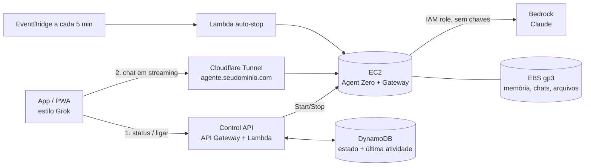

# Arquitetura — App pessoal com Agent Zero na AWS

Status: **proposta** (nada disso foi provisionado ainda).

## Objetivo

- App com experiência parecida com o Grok: tela limpa, campo de mensagem central, histórico na lateral, resposta em streaming, etapas de "pensando" que dá para expandir, voz e anexos.
- O cérebro é o Agent Zero com Claude via Bedrock, rodando numa VM EC2.
- A VM **só liga quando o app é usado** e **desliga sozinha** quando fica ociosa.

## Visão geral

Separação central: o que está **sempre ligado** é barato e serverless (frontend estático + Lambda). O que é **caro** (a VM) só existe quando você está usando.

## Componentes

### 1. Frontend (sempre ligado, ~grátis)
- **Next.js como PWA**: instala no celular e no desktop como app. Hospedado em S3 + CloudFront (ou Vercel).
- Se depois quiser app nas lojas: **Expo / React Native**, reaproveitando a mesma API.
- UX estilo Grok:
  - tema escuro, saudação e campo de entrada centralizados na tela inicial;
  - chips de modo: **Rápido** (Haiku) / **Padrão** (Sonnet) / **Power** (Opus), que são os presets do Agent Zero;
  - etapas do agente (planejar → executar comando → responder) num bloco recolhível "Pensando…";
  - lateral com histórico, busca e projetos;
  - anexos (arquivos/imagens) e modo voz (o Agent Zero já tem Whisper para STT e Kokoro para TTS).
- **Partida a frio sem fricção**: ao abrir, o app chama `/status`. Se a VM estiver desligada, ele pede para ligar e mostra "Acordando seu agente… ~60s", e você já pode digitar. A mensagem fica na fila e é enviada quando a VM fica pronta.

### 2. Control API (sempre ligado, ~grátis)
API Gateway (HTTP API) + Lambda, autenticada (Cognito ou JWT do provedor de login):

| Rota | Função |
|---|---|
| `GET /status` | estado da VM: `stopped / starting / ready / stopping` |
| `POST /start` | `ec2:StartInstances`, devolve quando o health check passa |
| `POST /stop` | desliga manualmente |
| `POST /heartbeat` | o app avisa que está em uso, atualizando `last_activity` |

### 3. Desligamento automático
- **EventBridge** roda uma Lambda a cada 5 min. Ela desliga a VM se:
  - `last_activity` tem mais de **20 min** (configurável), **e**
  - o Agent Zero **não tem tarefa em execução**. O gateway na VM expõe isso, para nunca matar uma tarefa longa no meio.
- Rede de segurança 1: **tempo máximo ligado** (ex.: 6h) e desliga mesmo assim, avisando antes.
- Rede de segurança 2: **AWS Budgets** com alerta por e-mail se o gasto mensal passar de um valor.

### 4. VM (liga sob demanda)
- **EC2 `t3.large`** (2 vCPU, 8 GB) em `us-east-1`. Dá para medir e reduzir ou aumentar depois.
- **AMI própria** já com Docker, imagem do Agent Zero, dependências e `cloudflared`, para o boot ser rápido.
- Serviço `systemd` sobe tudo no boot. Alvo: **pronto em ~60–90s** após o `start`. Depois dá para avaliar **EC2 Hibernate** para retomar ainda mais rápido.
- **Gateway fino (FastAPI)** ao lado do Agent Zero:
  - traduz a API do Agent Zero (`/api_message`, `/api_log_get`, websocket) para **SSE/streaming** num formato próprio do app;
  - informa "ocupado / ocioso" para o auto-stop;
  - isola o app do Agent Zero: se um dia trocar de motor, o frontend não muda.
- **Credenciais**: **IAM Instance Role** com `bedrock:InvokeModel*`. Nenhuma chave guardada na VM.
- **Dados** no volume EBS (memória, chats, arquivos de trabalho). Persistem com a VM desligada. Snapshot diário via Data Lifecycle Manager.

### 5. Rede e acesso
- **Cloudflare Tunnel**: endereço fixo (`agente.seudominio.com`), HTTPS grátis, **nenhuma porta aberta** na VM e sem custo de Elastic IP. Pode somar com **Cloudflare Access** como uma segunda camada de login.
- Alternativa só-AWS: a Lambda atualiza um registro no Route 53 a cada boot (o IP muda). É mais simples de explicar, mas expõe a porta.

## Custos estimados (us-east-1, uso pessoal)

| Item | Premissa | ~USD/mês |
|---|---|---|
| EC2 t3.large | 2h/dia × 30 dias = 60h × $0,083 | ~5 |
| EBS gp3 40 GB | cobrado mesmo desligada | ~3,2 |
| Lambda + API Gateway + DynamoDB + EventBridge | uso pessoal | <1 |
| Frontend (S3/CloudFront ou Vercel) | | ~0–1 |
| Cloudflare Tunnel | | 0 |
| **Bedrock (tokens)** | depende do uso e do modelo | **variável, é o maior custo** |

Se a VM ficasse ligada direto: ~$60/mês só de EC2.

## Infra como código

Tudo em **AWS CDK (TypeScript)**, na mesma linguagem do frontend: VPC/SG, EC2 + role, Lambdas, API Gateway, DynamoDB, EventBridge, Budgets. Um `cdk deploy` cria tudo; um `cdk destroy` remove tudo.

## Fases

1. **Infra liga/desliga**: CDK + AMI + Control API + auto-stop + túnel. Ao final, a UI atual do Agent Zero já abre sob demanda pelo seu domínio.
2. **App estilo Grok (PWA)**: chat com streaming, histórico, presets, tela de "acordando", login.
3. **Extras**: voz, anexos, notificação push quando uma tarefa longa terminar, app nas lojas (Expo).

## Decisões em aberto

- Só você vai usar, ou outras pessoas também? Com várias pessoas, a arquitetura muda para uma VM ou container por usuário.
- PWA primeiro, ou app nativo nas lojas desde o início?
- Tem domínio próprio e conta Cloudflare? Se não, uso a alternativa com Route 53.
- Acesso à conta AWS para deploy: precisa de um usuário/role com permissão de EC2, Lambda, IAM, API Gateway, DynamoDB e CloudFormation. Hoje este ambiente só tem acesso ao Bedrock.
