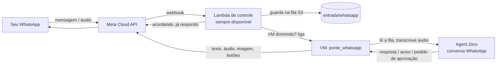

# Plano: o que o Dots e o Grok Bot fazem e o nosso agente ainda não

Status: **em execução** (08/10/2026). Fica de fora, por decisão do Matheus: **VM ligada 24h**. A VM continua
acordando sob demanda e hibernando quando ociosa. O que eles resolvem ficando sempre ligados, aqui se
resolve acordando a VM na hora certa (fases 1 e 5).

Referências: OpenAI **Dots** (agente pessoal no ChatGPT, lançado em 29/09/2026) e xAI **Grok Bot**
(agentes persistentes, agosto/2026). Pesquisa detalhada em `reports/` quando concluída.

## Estado (08/10/2026)

| Fase | Estado | Onde |
|---|---|---|
| 1. WhatsApp | **Pronto no servidor; falta um número brasileiro.** Recepção (Lambda + fila + acordar VM), ponte, áudio (Whisper `small`, PT), respostas, avisos, botões, `/nova /parar /atividade /gasto /ajuda`, alerta de gasto e de token. App "Agente Pessoal" (portfólio "Matheus Cardoso - Pessoal"), token de 60 dias e chave do app guardados sem passar pela conversa, webhook ativo. O **número de teste da Meta (EUA) não pode mandar mensagem para o Brasil** (erro 130497); é preciso registrar um número BR na conta (WABA 1084080951097350) e trocar o `phone_number_id` na caixa WhatsApp da página de controle. | `infra/control/whatsapp.py`, `infra/vm/ponte_whatsapp.py`, plugin `whatsapp` |
| 2. Aprovações e regras | **Pronto e testado** (recusa manteve os arquivos; proteção contra loop: 3ª aprovação igual em 10 min é recusada) | plugin `aprovacoes` |
| 3. Cofre + 2FA | **Pronto** (cofre por pessoa; `FACEBOOK_SENHA` guardada; senha vazada trocada pelo nome em 13 arquivos; `pedir_codigo`) | plugin `cofre`, `whatsapp/tools/pedir_codigo.py` |
| 4. Rotinas | **Pronto e testado** (`salvar_rotina`, correções, `me_mostre`) | plugin `rotinas` |
| 5. Gatilhos + despertar exato | **Pronto e testado** (despertar 5 min antes da próxima tarefa; fixo 4x/dia removido; gatilho chegou na conversa "Gatilhos") | `proximo_despertar.py`, `criar_gatilho` |
| 6. Resumo diário só leitura | **Pronto e testado** (07h45, conversa marcada como só leitura) | tarefa "📰 Resumo do dia" |
| 7. Conectores Google | **Falta o login do Matheus** (ver abaixo) | — |
| 8. Áreas com função | **Pronto**: projetos "Meta e NEXOS" e "Saúde" com regras próprias (+ "Carreira") | projetos do Agent Zero |
| 9. Voz | **Avaliado** (ver abaixo) | — |
| Extras da pesquisa | registro de atividades, medidor/alerta de gasto, `/parar`, revisor independente, modo só leitura | — |

## Ordem e esforço

| Fase | O que você ganha | Esforço | Depende de |
|---|---|---|---|
| **1. WhatsApp** (prioridade) | Mandar **texto, áudio, foto e arquivo** pelo WhatsApp e receber a resposta lá; ele **te avisa** quando trava esperando você ou termina | 2–3 dias | número e app da Meta (decisões abaixo) |
| 2. Aprovar com botão + regras suas | "Pode fazer / pergunte antes / nunca" editáveis; cartão **Aprovar / Recusar** na tela e no WhatsApp | 2 dias | 1 |
| 3. Cofre de senhas + 2FA | O agente faz login **sem ver a senha**; 2FA e captcha sempre com você, pedidos pelo WhatsApp | 1–2 dias | 1 |
| 4. Rotinas ("me mostre uma vez") | Tarefa que deu certo vira rotina reutilizável; você faz uma vez no navegador e ele aprende; correções viram regra | 2–3 dias | — |
| 5. Gatilhos por evento + acordar na hora certa | Começa sozinho quando algo acontece (e-mail novo, mensagem, webhook); a VM acorda **exatamente** na hora de cada tarefa agendada, não mais 4x/dia fixas | 2 dias | 1 |
| 6. Proativo (só leitura) | Resumo diário no WhatsApp: o que mudou, o que está parado, o que precisa de você — sem enviar nem alterar nada | 1 dia | 1, 5, 7 |
| 7. Conectores | Gmail, Agenda e Drive direto (sem passar pelo navegador), começando só leitura | 2 dias | contas Google |
| 8. Agentes com função | "Meta/NEXOS", "Saúde", "Carreira"… cada um com memória e regras próprias, e um resumo geral | 2 dias | 2, 4 |
| 9. Chamada de voz | Ligar para ele (e ele para você) pelo WhatsApp | avaliar | 1 |

## Fase 1 — WhatsApp (texto, áudio, foto, arquivo, avisos)

Caminho oficial: **WhatsApp Cloud API** da Meta, num **app novo e só seu** ("Agente Pessoal"), separado
do NEXOS e da Barber Dock. Sem WhatsApp "pirata" (risco de banimento) e sem depender da VM ligada.

1. **Recepção (Lambda já existente, nova rota `/whatsapp`)**
   - valida a assinatura da Meta (`X-Hub-Signature-256`) e aceita **só os números cadastrados**;
   - guarda a mensagem (e a mídia) na fila do S3 e liga a VM se estiver dormindo;
   - se a VM estava dormindo, responde na hora: "Acordando, te respondo em ~1 min".
2. **Ponte na VM (`ponte_whatsapp`, serviço novo)**
   - ao acordar e a cada poucos segundos, lê a fila e entrega no Agent Zero;
   - **áudio** → transcrição com o Whisper que já roda no Agent Zero; a conversa mostra o texto transcrito;
   - foto/arquivo → anexos da conversa;
   - cada pessoa tem **uma conversa "WhatsApp"**; `/nova` começa outra; dá para mandar "na conversa da Meta: …" para falar com uma conversa específica;
   - conta como atividade (a VM não hiberna no meio de uma conversa).
3. **Respostas e avisos (plugin novo no Agent Zero)**
   - resposta final do agente → WhatsApp (texto; **áudio de volta se você mandou áudio**, opcional);
   - prints e arquivos que ele gerar → mídia no WhatsApp;
   - **avisos**: travou esperando você, `/goal` concluído ou bloqueado, tarefa agendada terminou, precisa de 2FA;
   - fora da janela de 24h do WhatsApp, o aviso sai por um **modelo aprovado** ("Seu agente precisa de você: …").
4. **Segurança**
   - números aceitos por usuário (Matheus, e quem mais tiver login); qualquer outro é ignorado;
   - token da Meta no SSM (criptografado), nunca no git nem na conversa;
   - nada de mensagem a terceiros: a ponte só fala com os números cadastrados.

**Pronto quando:** você manda um áudio com a VM dormindo, recebe "acordando", e em ~1–2 min a resposta
chega no WhatsApp; um `/goal` que trava esperando você manda aviso no WhatsApp.

## Fase 2 — Aprovar com botão + regras suas

- `regras` por pessoa, editáveis na tela: **pode fazer**, **pergunte antes**, **nunca**, por tipo de
  ação: pagamento, aceitar termos, contas reais, apagar, mandar mensagem a terceiros, enviar para
  análise, publicar, comprar, mexer em produção.
- **Revisão automática** antes de ações de risco (cliques de envio/confirmação, comandos que apagam,
  envio de formulário): a Luna classifica contra as suas regras; se for "pergunte antes", o agente
  **para** e manda o cartão **Aprovar / Recusar** (na tela e com botões no WhatsApp). "Nunca" bloqueia
  sem perguntar.
- As regras fixas de hoje (prompt + Sol) viram a base dessas regras.

## Fase 3 — Cofre de senhas + 2FA

- Senhas no cofre do Agent Zero (`Secrets`): o agente usa o **nome** da senha e ela é preenchida no
  navegador **sem passar pelo modelo**.
- Senhas que já passaram pela conversa: listar onde aparecem e te propor limpar (só com seu ok) e trocar.
- 2FA/captcha: o agente para e pede pelo WhatsApp; você responde o código ou assume a tela pelo link.

## Fase 4 — Rotinas ("me mostre uma vez")

- **Salvar como rotina**: depois de uma tarefa que deu certo, um botão/comando gera a rotina (passos,
  regras de decisão, o que entregar, o que precisa de aprovação), que você revisa e usa com `/rotina nome`
  ou agenda.
- **Me mostre uma vez**: você faz a tarefa no Navegador (ou no Celular) com "gravar" ligado; o agente
  transforma o que viu em rascunho de rotina e testa.
- **Correções viram regra**: quando você corrige ("não, sempre na conta raiz"), ele grava na memória da
  rotina/conversa para não repetir.

## Fase 5 — Gatilhos por evento + acordar na hora certa

- Hoje a VM acorda em 4 horários fixos para as tarefas agendadas. Passa a ser: ao hibernar, a VM agenda
  na AWS um despertar **no horário da próxima tarefa**; nada agendado = nada acorda.
- Gatilhos: mensagem no WhatsApp (fase 1), e-mail recebido (endereço próprio do agente ou Gmail),
  webhook genérico (ex.: NEXOS avisar algo). Cada gatilho põe a tarefa na fila e acorda a VM.

## Fase 6 — Proativo, só leitura

- Resumo diário (horário à sua escolha) no WhatsApp: tarefas paradas ou bloqueadas, o que mudou nas
  fontes conectadas (e-mail, agenda, status da Meta), sugestões do que ele pode fazer.
- Nesse modo ele **só lê**: não envia, não altera, não clica em nada que mude estado.

## Fase 7 — Conectores

- Gmail, Google Agenda e Drive por MCP (o Agent Zero já suporta), autorizados uma vez com a sua conta;
  começando **só leitura**. Mais rápido e confiável que pelo navegador.
- **O que falta**: o consentimento OAuth do Google só pode ser dado por você, logado na sua conta (o
  agente não aceita termos nem faz login novo em contas reais por conta própria). Caminho: um projeto no
  Google Cloud com tela de consentimento "Testing" e você como usuário de teste, cliente OAuth "Desktop",
  e um servidor MCP de Google Workspace no Agent Zero; o revisor de aprovações já trata ferramentas MCP
  que escrevem (enviar, criar, apagar) como ações a aprovar.

## Fase 8 — Agentes com função

- Perfis fixos por área ("Meta/NEXOS", "Saúde/Exames", "Carreira"), cada um com instruções, memória e
  regras próprias, sobre os projetos do Agent Zero.
- Um "chefe de gabinete" que junta o estado de todos no resumo diário.

## Fase 9 — Chamada de voz (avaliação)

- A API de chamadas do WhatsApp Business existe, mas exige número real (não o de teste) e WebRTC no
  servidor, que precisa estar ligado na hora da ligação; com a VM hibernando, a primeira chamada levaria
  ~1 min para atender. Áudio já resolve o dia a dia (transcrição em ~8 s).
- Recomendação: não fazer agora. Revisitar com o número BR ativo, se quiser "ligar para o agente";
  dá para responder com áudio (voz sintética) usando o Kokoro que já vem no Agent Zero.

## Decisões pendentes (Matheus)

1. **Número do agente no WhatsApp**: número de teste grátis da Meta (fala só com até 5 números
   cadastrados; dá para começar hoje) ou um chip/número próprio.
2. **App novo "Agente Pessoal" na Meta**, no seu portfólio pessoal, separado do NEXOS e da Barber Dock.
3. **Responder em áudio** quando você mandar áudio?
4. Outras pessoas com login também usam pelo WhatsApp?
